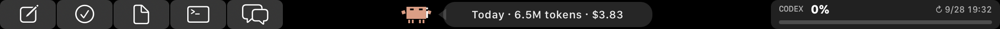

# Codex Touch Bar for MTMR 2026

An Apple-style Touch Bar layout built specifically for the Codex desktop app on
Apple silicon Macs. MTMR is shown only while Codex is active; other apps keep
their native Apple Touch Bar.



## Features

- Native-style monochrome shortcut buttons.
- Animated Clawd pet with tap, double-tap, and long-press reactions.
- Live daily token count and estimated cost from TokenTracker, with a local
  Codex session-log fallback.
- Tap the center message bubble to switch between daily usage and the seven-day
  Codex quota; the pet changes pose with the page.
- Remaining-quota progress bar and next reset time, refreshed every 30 seconds.
- Keyboard-combination actions for Codex shortcuts.

## Files

- `items.json` — the ready-to-use preset.
- `MTMR-CodexTouchBar.patch` — the complete native Swift changes required by
  this preset, based on `josmanvis/mtmr-designer` at tag
  `v2026.1-build.18` (`97670cb`).
- `codex-touchbar.png` — a Touch Bar capture of the installed layout.

## Install

1. Clone `https://github.com/josmanvis/mtmr-designer` and check out
   `v2026.1-build.18`.
2. From the repository root, apply the patch:

   ```bash
   git apply /path/to/MTMR-CodexTouchBar.patch
   ```

3. Build the `MTMR` scheme in `mtmr-src/MTMR.xcodeproj` for Apple silicon.
4. Copy `items.json` to:

   ```text
   ~/Library/Application Support/MTMR/items.json
   ```

5. Grant the built app Accessibility permission in System Settings.

TokenTracker is optional. When its local usage API is available, MTMR uses it
for the daily token and cost totals; otherwise it reads local Codex session
logs. No credentials, signing certificates, or private account data are
included in this preset.
